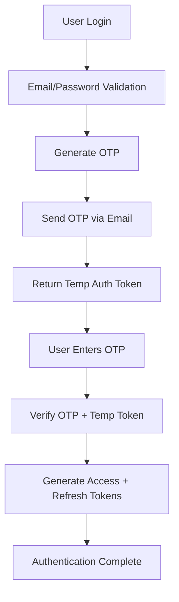

# Wellio Diet Tracker Backend - Frontend Integration Documentation

## 📋 Table of Contents
1. [Project Overview](#project-overview)
2. [Backend Architecture](#backend-architecture)
3. [Authentication System](#authentication-system)
4. [API Endpoints Reference](#api-endpoints-reference)
5. [Data Models & Schemas](#data-models--schemas)
6. [Integration Guidelines](#integration-guidelines)
7. [Error Handling](#error-handling)
8. [Environment Setup](#environment-setup)
9. [Testing & Development](#testing--development)
10. [Security Considerations](#security-considerations)

---

## 🎯 Project Overview

### What We've Built
The **Wellio Diet Tracker Backend** is a comprehensive Node.js/Express REST API that provides:

- **Secure User Authentication** with JWT tokens and OTP verification
- **Super Admin Panel** for platform management
- **Company/Branding Management** with logo upload capabilities
- **Policy Management** for privacy policy and terms & conditions
- **User Profile Management** with diet/health tracking data
- **Water Intake Tracking** with daily goals and progress
- **Supplements Schedule Management** with reminder notifications
- **Email Integration** for OTP and notifications
- **Image Upload** via ImgBB API integration

### Target Users
- **End Users**: People tracking their diet and health
- **Super Administrators**: Platform managers with full access
- **Public Visitors**: Accessing company info and policies

### Key Features Implemented
✅ **JWT-based authentication** with access/refresh tokens  
✅ **Two-factor authentication** via email OTP  
✅ **Google OAuth integration** for social login  
✅ **Role-based access control** (User vs Admin)  
✅ **Company branding management** with logo uploads  
✅ **Dynamic policy management** (Privacy Policy, Terms)  
✅ **Comprehensive user profiles** with physical metrics  
✅ **Water intake tracking** with daily goals and progress monitoring  
✅ **Supplements schedule management** with automated push notifications  
✅ **Email notifications** and OTP delivery  
✅ **Public API endpoints** for company info and policies  
✅ **Admin session management** and security features  
✅ **Swagger API documentation** at `/api-docs`  

---

## 🏗️ Backend Architecture

### Technology Stack
- **Runtime**: Node.js (v14+)
- **Framework**: Express.js (v4.21.2)
- **Database**: MongoDB with Mongoose ODM
- **Authentication**: JWT + bcryptjs + Google OAuth
- **Email Service**: Nodemailer with SMTP
- **Image Storage**: ImgBB API
- **Validation**: Joi
- **Security**: Helmet, CORS, Rate Limiting
- **Documentation**: Swagger/OpenAPI

### Project Structure
```
src/
├── config/
│   └── swagger.js          # API documentation config
├── controllers/
│   ├── authController.js   # User authentication logic
│   ├── userController.js   # User profile management
│   ├── superAdminController.js # Admin panel logic
│   ├── companyController.js    # Company/branding management
│   └── policyController.js     # Policy management
├── middleware/
│   ├── auth.js            # Authentication middleware
│   └── rateLimiter.js     # Rate limiting middleware
├── models/
│   ├── User.js            # User data model
│   ├── SuperAdmin.js      # Admin data model
│   ├── Company.js         # Company info model
│   └── Policy.js          # Policy documents model
├── routes/
│   ├── auth.js            # Authentication routes
│   ├── user.js            # User management routes
│   ├── admin.js           # Admin panel routes
│   ├── company.js         # Public company routes
│   └── policy.js          # Public policy routes
└── utils/
    ├── tokenUtils.js      # JWT token management
    ├── otpUtils.js        # OTP generation/validation
    ├── emailUtils.js      # Email sending utilities
    ├── passwordUtils.js   # Password hashing/validation
    ├── validationUtils.js # Input validation
    ├── responseUtils.js   # Standardized API responses
    ├── googleAuth.js      # Google OAuth integration
    └── imgbbUtils.js      # Image upload utilities
```

### API Versioning
All endpoints are versioned under `/v1/` to ensure backward compatibility.

### Database Models
- **Users**: Authentication, profiles, physical metrics
- **SuperAdmins**: Platform administrators with enhanced security
- **Company**: Branding, contact info, social media
- **Policies**: Privacy policy, terms & conditions with versioning

---

## 🔐 Authentication System

### Authentication Flow Overview
The backend implements a **multi-step authentication system** for enhanced security:



### Token Types Explained

#### 1. **Temporary Authentication Token (1F Token)**
- **Purpose**: Bridge between login and OTP verification
- **Lifespan**: 60 seconds
- **Usage**: Required for OTP verification endpoint
- **Security**: Single-use, short-lived

#### 2. **Access Token**
- **Purpose**: API authentication for protected endpoints
- **Lifespan**: 1 hour (configurable)
- **Usage**: Include in `Authorization: Bearer <token>` header
- **Security**: Contains user ID and permissions

#### 3. **Refresh Token**
- **Purpose**: Obtain new access tokens without re-login
- **Lifespan**: 7 days (configurable)
- **Usage**: Send to `/v1/auth/refresh-token` endpoint
- **Security**: Longer-lived, can be revoked

### User Roles & Permissions
- **Regular User**: Access to own profile and user endpoints
- **Super Admin**: Full access to admin panel, company, and policy management
- **Public**: Access to company info and policies without authentication

---

## 🚀 API Endpoints Reference

### Base Configuration
- **Base URL**: `http://localhost:8080` (development)
- **API Version**: `/v1`
- **Content-Type**: `application/json`
- **Authentication**: `Authorization: Bearer <token>`

### 🔓 Public Endpoints (No Authentication Required)

#### System Health & Info
```http
GET /                    # Welcome message and API info
GET /health             # System health check
GET /v1                 # API version info
GET /api-docs           # Swagger documentation (browser)
```

#### Company Information
```http
GET /v1/company         # Get company details, logo, contact info
```

#### Legal Policies
```http
GET /v1/policy/privacy-policy      # Get current privacy policy
GET /v1/policy/terms-conditions    # Get current terms & conditions
```

### 🔐 Authentication Endpoints

#### User Registration & Login
```http
POST /v1/auth/signup              # User registration (requires name, username, firstName, lastName)
POST /v1/auth/login               # Step 1: Login (returns temp token + sends OTP)
POST /v1/auth/verify-otp          # Step 2: Verify OTP (returns access/refresh tokens)
POST /v1/auth/google-login        # Google OAuth login
```

#### Token Management
```http
POST /v1/auth/refresh-token       # Refresh access token
POST /v1/auth/logout              # Logout and blacklist token
```

#### Profile Management
```http
GET  /v1/auth/profile             # Get user profile
DELETE /v1/auth/delete-account    # Delete user account
```

### 👤 User Management Endpoints

```http
GET    /v1/user/profile           # Get detailed user profile
PUT    /v1/user/profile           # Update profile (phone, address, physical info)
GET    /v1/user/:id               # Get user by ID (admin or own)
POST   /v1/user/forgot-password   # Request password reset
POST   /v1/user/reset-password    # Reset password with token
DELETE /v1/user/account           # Delete account with password confirmation
```

### 💧 Water Tracker Endpoints

#### Water Intake Management
```http
POST /v1/water/add                # Add water intake entry
GET  /v1/water/daily?date=YYYY-MM-DD  # Get daily water intake data
PUT  /v1/water/goal               # Update daily water goal
```

**Request Examples:**

**Add Water Intake:**
```json
POST /v1/water/add
{
  "amount": 250  // Amount in ml
}
```

**Get Daily Water Intake:**
```http
GET /v1/water/daily?date=2024-01-15
// If date is omitted, returns today's data
```

**Update Water Goal:**
```json
PUT /v1/water/goal
{
  "dailyGoal": 2000  // Daily goal in ml (default: 2000)
}
```

**Response Examples:**

**Daily Water Intake Response:**
```json
{
  "status": "success",
  "message": "Daily water intake retrieved successfully",
  "data": {
    "goal": 2000,
    "total": 1250,
    "entries": [
      {
        "id": "65a1b2c3d4e5f6g7h8i9j0k1",
        "amount": 250,
        "timestamp": "2024-01-15T08:30:00.000Z",
        "createdAt": "2024-01-15T08:30:00.000Z"
      },
      {
        "id": "65a1b2c3d4e5f6g7h8i9j0k2",
        "amount": 500,
        "timestamp": "2024-01-15T12:00:00.000Z",
        "createdAt": "2024-01-15T12:00:00.000Z"
      },
      {
        "id": "65a1b2c3d4e5f6g7h8i9j0k3",
        "amount": 500,
        "timestamp": "2024-01-15T15:45:00.000Z",
        "createdAt": "2024-01-15T15:45:00.000Z"
      }
    ]
  },
  "timestamp": "2024-01-15T16:00:00.000Z"
}
```

### 💊 Supplements Tracker Endpoints

#### Supplement Schedule Management
```http
POST   /v1/supplements            # Create supplement schedule
GET    /v1/supplements            # Get all supplements for user
PUT    /v1/supplements/:id        # Update supplement schedule
DELETE /v1/supplements/:id         # Delete supplement schedule
```

#### Supplement Logging
```http
POST /v1/supplements/log           # Log supplement intake
GET  /v1/supplements/logs?month=YYYY-MM  # Get monthly supplement logs
```

**Request Examples:**

**Create Supplement Schedule:**
```json
POST /v1/supplements
{
  "name": "Vitamin D",
  "time": "09:00",  // HH:MM format
  "days": ["Mon", "Wed", "Fri"],  // Day abbreviations
  "notes": "Take with breakfast"  // Optional
}
```

**Update Supplement:**
```json
PUT /v1/supplements/:id
{
  "name": "Vitamin D3",
  "time": "10:00",
  "days": ["Mon", "Tue", "Wed", "Thu", "Fri"],
  "notes": "Updated dosage"
}
```

**Log Supplement Intake:**
```json
POST /v1/supplements/log
{
  "supplementId": "65a1b2c3d4e5f6g7h8i9j0k1",
  "status": "taken"  // or "skipped"
}
```

**Get Monthly Logs:**
```http
GET /v1/supplements/logs?month=2024-01
// If month is omitted, returns current month's logs
```

**Response Examples:**

**Get All Supplements:**
```json
{
  "status": "success",
  "message": "Supplements retrieved successfully",
  "data": {
    "supplements": [
      {
        "id": "65a1b2c3d4e5f6g7h8i9j0k1",
        "name": "Vitamin D",
        "time": "09:00",
        "days": ["Mon", "Wed", "Fri"],
        "notes": "Take with breakfast",
        "createdAt": "2024-01-10T08:00:00.000Z",
        "updatedAt": "2024-01-10T08:00:00.000Z"
      },
      {
        "id": "65a1b2c3d4e5f6g7h8i9j0k2",
        "name": "Omega 3",
        "time": "18:00",
        "days": ["Mon", "Tue", "Wed", "Thu", "Fri", "Sat", "Sun"],
        "notes": null,
        "createdAt": "2024-01-12T10:00:00.000Z",
        "updatedAt": "2024-01-12T10:00:00.000Z"
      }
    ]
  },
  "timestamp": "2024-01-15T16:00:00.000Z"
}
```

**Monthly Supplement Logs:**
```json
{
  "status": "success",
  "message": "Supplement logs retrieved successfully",
  "data": {
    "logs": [
      {
        "date": "2024-01-15",
        "logs": [
          {
            "id": "65a1b2c3d4e5f6g7h8i9j0k3",
            "supplementId": "65a1b2c3d4e5f6g7h8i9j0k1",
            "supplementName": "Vitamin D",
            "status": "taken",
            "timestamp": "2024-01-15T09:00:00.000Z",
            "createdAt": "2024-01-15T09:00:00.000Z"
          }
        ]
      },
      {
        "date": "2024-01-13",
        "logs": [
          {
            "id": "65a1b2c3d4e5f6g7h8i9j0k4",
            "supplementId": "65a1b2c3d4e5f6g7h8i9j0k1",
            "supplementName": "Vitamin D",
            "status": "skipped",
            "timestamp": "2024-01-13T09:00:00.000Z",
            "createdAt": "2024-01-13T09:00:00.000Z"
          }
        ]
      }
    ]
  },
  "timestamp": "2024-01-15T16:00:00.000Z"
}
```

**Valid Day Abbreviations:**
- `Mon`, `Tue`, `Wed`, `Thu`, `Fri`, `Sat`, `Sun`

**Valid Status Values:**
- `taken` - User took the supplement
- `skipped` - User skipped the supplement

### 🛡️ Super Admin Endpoints

#### Admin Authentication
```http
POST /v1/admin/setup                    # One-time admin setup
POST /v1/admin/login                    # Admin login
POST /v1/admin/security-question        # Get security question
POST /v1/admin/recover-password         # Password recovery with security answer
```

#### Admin Management
```http
GET    /v1/admin/profile                # Get admin profile
PUT    /v1/admin/change-password        # Change admin password
POST   /v1/admin/logout                 # Admin logout
GET    /v1/admin/sessions               # Get active sessions
DELETE /v1/admin/sessions/:sessionId    # Revoke specific session
```

#### Company Management (Admin Only)
```http
GET    /v1/admin/company               # Get company info (admin view)
PUT    /v1/admin/company               # Update company information
POST   /v1/admin/company/logo          # Upload company logo
DELETE /v1/admin/company/logo          # Remove company logo
POST   /v1/admin/company/phone         # Add phone number
POST   /v1/admin/company/email         # Add email address
```

#### Policy Management (Admin Only)
```http
GET    /v1/admin/policy                       # Get all policies with admin data
POST   /v1/admin/policy/privacy-policy        # Upload/update privacy policy
POST   /v1/admin/policy/terms-conditions      # Upload/update terms & conditions
GET    /v1/admin/policy/stats                 # Get policy statistics
GET    /v1/admin/policy/:id                   # Get specific policy by ID
PATCH  /v1/admin/policy/:id/status            # Update policy status
DELETE /v1/admin/policy/:id                   # Delete policy
```

---

## 📊 Data Models & Schemas

### User Profile Structure
```json
{
  "id": "string",
  "name": "string",
  "username": "string",
  "firstName": "string",
  "lastName": "string",
  "email": "string",
  "isGoogleUser": boolean,
  "isVerified": boolean,
  "createdAt": "ISO date",
  "lastLogin": "ISO date",
  "profile": {
    "phoneNumber": "string (+1234567890)",
    "address": {
      "street1": "string",
      "street2": "string", 
      "lane": "string",
      "city": "string",
      "state": "string",
      "pincode": "string (6 digits)"
    },
    "physicalInfo": {
      "currentWeight": number,
      "currentHeight": number,
      "weightUnit": "kg | lbs",
      "heightUnit": "cm | ft"
    }
  }
}
```

### Company Information Structure
```json
{
  "name": "string",
  "logo": {
    "imageUrl": "string (ImgBB URL)",
    "thumbnailUrl": "string (ImgBB thumbnail)",
    "size": number,
    "width": number,
    "height": number
  },
  "address": {
    "street1": "string",
    "street2": "string",
    "city": "string", 
    "state": "string",
    "pincode": "string",
    "country": "string"
  },
  "contactInfo": {
    "phoneNumbers": [
      {
        "number": "string",
        "type": "primary | secondary | support | sales",
        "label": "string"
      }
    ],
    "emails": [
      {
        "email": "string",
        "type": "primary | support | sales | info | noreply", 
        "label": "string"
      }
    ],
    "website": "string (URL)",
    "socialMedia": {
      "facebook": "string (URL)",
      "twitter": "string (URL)",
      "instagram": "string (URL)"
    }
  },
  "description": "string",
  "establishedYear": number,
  "industry": "string"
}
```

### Policy Document Structure
```json
{
  "id": "string",
  "title": "string",
  "type": "privacy-policy | terms-conditions",
  "content": "string (Markdown)",
  "version": number,
  "status": "draft | active | archived",
  "effectiveFrom": "ISO date",
  "lastUpdated": "ISO date",
  "wordCount": number,
  "estimatedReadingTime": number,
  "changes": "string",
  "metaDescription": "string",
  "keywords": ["string"]
}
```

### Authentication Response Structure
```json
{
  "status": "success | error",
  "message": "string",
  "data": {
    "user": { /* User profile object */ },
    "tokens": {
      "accessToken": "string (JWT)",
      "refreshToken": "string (JWT)",
      "tokenType": "Bearer",
      "expiresIn": "1h"
    }
  },
  "timestamp": "ISO date"
}
```

### Water Tracker Data Structures

#### Water Intake Entry
```json
{
  "id": "string (MongoDB ObjectId)",
  "amount": number,  // Amount in ml
  "timestamp": "ISO date",
  "createdAt": "ISO date",
  "updatedAt": "ISO date"
}
```

#### Water Goal
```json
{
  "userId": "string (MongoDB ObjectId)",
  "dailyGoal": number,  // Daily goal in ml (default: 2000)
  "updatedAt": "ISO date"
}
```

#### Daily Water Intake Response
```json
{
  "goal": number,  // Daily goal in ml
  "total": number,  // Total intake for the day in ml
  "entries": [
    {
      "id": "string",
      "amount": number,
      "timestamp": "ISO date",
      "createdAt": "ISO date"
    }
  ]
}
```

### Supplements Tracker Data Structures

#### Supplement Schedule
```json
{
  "id": "string (MongoDB ObjectId)",
  "name": "string",  // e.g., "Vitamin D", "Omega 3"
  "time": "string",  // HH:MM format (e.g., "09:00")
  "days": ["string"],  // Array of day abbreviations: ["Mon", "Wed", "Fri"]
  "notes": "string | null",  // Optional notes
  "createdAt": "ISO date",
  "updatedAt": "ISO date"
}
```

#### Supplement Log Entry
```json
{
  "id": "string (MongoDB ObjectId)",
  "supplementId": "string (MongoDB ObjectId)",
  "supplementName": "string",  // Populated from supplement
  "status": "taken | skipped",
  "timestamp": "ISO date",
  "createdAt": "ISO date"
}
```

#### Monthly Supplement Logs Response
```json
{
  "logs": [
    {
      "date": "YYYY-MM-DD",  // Date string
      "logs": [
        {
          "id": "string",
          "supplementId": "string",
          "supplementName": "string",
          "status": "taken | skipped",
          "timestamp": "ISO date",
          "createdAt": "ISO date"
        }
      ]
    }
  ]
}
```

**Valid Day Abbreviations:**
- `Mon` - Monday
- `Tue` - Tuesday
- `Wed` - Wednesday
- `Thu` - Thursday
- `Fri` - Friday
- `Sat` - Saturday
- `Sun` - Sunday

**Valid Status Values:**
- `taken` - User took the supplement
- `skipped` - User skipped the supplement

---

## 🔧 Integration Guidelines

### Frontend Setup Requirements

#### 1. Environment Configuration
Create environment variables for:
```env
REACT_APP_API_BASE_URL=http://localhost:8080
REACT_APP_API_VERSION=v1
REACT_APP_GOOGLE_CLIENT_ID=your_google_client_id
```

#### 2. HTTP Client Configuration
```javascript
// Example using Axios
import axios from 'axios';

const API = axios.create({
  baseURL: process.env.REACT_APP_API_BASE_URL,
  timeout: 10000,
  headers: {
    'Content-Type': 'application/json',
  },
});

// Request interceptor for authentication
API.interceptors.request.use((config) => {
  const token = localStorage.getItem('accessToken');
  if (token) {
    config.headers.Authorization = `Bearer ${token}`;
  }
  return config;
});

// Response interceptor for token refresh
API.interceptors.response.use(
  (response) => response,
  async (error) => {
    if (error.response?.status === 401) {
      // Handle token refresh or redirect to login
      await refreshToken();
    }
    return Promise.reject(error);
  }
);
```

### Authentication Implementation

#### 1. Login Flow Implementation
```javascript
// Step 1: Initial login
const login = async (email, password) => {
  try {
    const response = await API.post('/v1/auth/login', { email, password });
    
    // Store temporary token
    const { tempAuthToken } = response.data.data;
    localStorage.setItem('tempAuthToken', tempAuthToken);
    
    // Redirect to OTP verification page
    return { success: true, requiresOTP: true };
  } catch (error) {
    return { success: false, error: error.response.data.message };
  }
};

// Signup Implementation
const signup = async (userData) => {
  try {
    // userData should include: email, password, name, username, firstName, lastName
    const response = await API.post('/v1/auth/signup', userData);
    return { success: true, user: response.data.data.user };
  } catch (error) {
    return { success: false, error: error.response.data.message };
  }
};

// Step 2: OTP Verification
const verifyOTP = async (otp) => {
  try {
    const tempToken = localStorage.getItem('tempAuthToken');
    const response = await API.post('/v1/auth/verify-otp', {
      token: tempToken,
      otp: otp
    });
    
    // Store tokens
    const { accessToken, refreshToken } = response.data.data.tokens;
    localStorage.setItem('accessToken', accessToken);
    localStorage.setItem('refreshToken', refreshToken);
    localStorage.removeItem('tempAuthToken');
    
    return { success: true, user: response.data.data.user };
  } catch (error) {
    return { success: false, error: error.response.data.message };
  }
};
```

#### 2. Token Refresh Implementation
```javascript
const refreshToken = async () => {
  try {
    const refreshToken = localStorage.getItem('refreshToken');
    const response = await axios.post('/v1/auth/refresh-token', {}, {
      headers: { Authorization: `Bearer ${refreshToken}` }
    });
    
    const { accessToken, refreshToken: newRefreshToken } = response.data.data;
    localStorage.setItem('accessToken', accessToken);
    localStorage.setItem('refreshToken', newRefreshToken);
    
    return true;
  } catch (error) {
    // Refresh failed, redirect to login
    localStorage.clear();
    window.location.href = '/login';
    return false;
  }
};
```

#### 3. Google OAuth Implementation
```javascript
// Install: npm install @google-cloud/auth-library
import { GoogleAuth } from '@google-cloud/auth-library';

const handleGoogleLogin = async (googleToken) => {
  try {
    const response = await API.post('/v1/auth/google-login', {
      googleToken: googleToken
    });
    
    // Same OTP flow as regular login
    const { tempAuthToken } = response.data.data;
    localStorage.setItem('tempAuthToken', tempAuthToken);
    
    return { success: true, requiresOTP: true };
  } catch (error) {
    return { success: false, error: error.response.data.message };
  }
};
```

### Profile Management

#### User Profile Update
```javascript
const updateProfile = async (profileData) => {
  try {
    const response = await API.put('/v1/user/profile', profileData);
    return { success: true, user: response.data.data.user };
  } catch (error) {
    return { success: false, error: error.response.data.message };
  }
};

// Example profile data structure
const profileData = {
  phoneNumber: "+1234567890",
  address: {
    street1: "123 Main St",
    city: "New York",
    state: "NY",
    pincode: "123456"
  },
  physicalInfo: {
    currentWeight: 70.5,
    currentHeight: 175.5,
    weightUnit: "kg",
    heightUnit: "cm"
  }
};
```

### Public Data Fetching

#### Company Information
```javascript
const getCompanyInfo = async () => {
  try {
    // No authentication required
    const response = await axios.get(`${API_BASE_URL}/v1/company`);
    return response.data.data.company;
  } catch (error) {
    console.error('Failed to fetch company info:', error);
    return null;
  }
};
```

#### Legal Policies
```javascript
const getPrivacyPolicy = async () => {
  try {
    const response = await axios.get(`${API_BASE_URL}/v1/policy/privacy-policy`);
    return response.data.data.policy;
  } catch (error) {
    console.error('Failed to fetch privacy policy:', error);
    return null;
  }
};

const getTermsConditions = async () => {
  try {
    const response = await axios.get(`${API_BASE_URL}/v1/policy/terms-conditions`);
    return response.data.data.policy;
  } catch (error) {
    console.error('Failed to fetch terms & conditions:', error);
    return null;
  }
};
```

### Water Tracker Integration

#### Add Water Intake
```javascript
const addWaterIntake = async (amount) => {
  try {
    const response = await API.post('/v1/water/add', { amount });
    return { success: true, data: response.data.data };
  } catch (error) {
    return { success: false, error: error.response?.data?.message || 'Failed to add water intake' };
  }
};

// Usage example
const handleAddWater = async () => {
  const result = await addWaterIntake(250); // 250ml
  if (result.success) {
    console.log('Water intake added:', result.data);
    // Refresh daily data
    await fetchDailyWaterIntake();
  }
};
```

#### Get Daily Water Intake
```javascript
const getDailyWaterIntake = async (date = null) => {
  try {
    const url = date 
      ? `/v1/water/daily?date=${date}` 
      : '/v1/water/daily';
    const response = await API.get(url);
    return { success: true, data: response.data.data };
  } catch (error) {
    return { success: false, error: error.response?.data?.message || 'Failed to fetch water intake' };
  }
};

// Usage example
const fetchDailyWater = async () => {
  // Get today's data
  const today = await getDailyWaterIntake();
  
  // Get specific date
  const specificDate = await getDailyWaterIntake('2024-01-15');
  
  if (today.success) {
    const { goal, total, entries } = today.data;
    const percentage = (total / goal) * 100;
    console.log(`Water intake: ${total}ml / ${goal}ml (${percentage.toFixed(1)}%)`);
  }
};
```

#### Update Water Goal
```javascript
const updateWaterGoal = async (dailyGoal) => {
  try {
    const response = await API.put('/v1/water/goal', { dailyGoal });
    return { success: true, data: response.data.data };
  } catch (error) {
    return { success: false, error: error.response?.data?.message || 'Failed to update water goal' };
  }
};

// Usage example
const handleUpdateGoal = async () => {
  const result = await updateWaterGoal(3000); // Set goal to 3000ml
  if (result.success) {
    console.log('Water goal updated:', result.data);
  }
};
```

### Supplements Tracker Integration

#### Create Supplement Schedule
```javascript
const createSupplement = async (supplementData) => {
  try {
    const response = await API.post('/v1/supplements', supplementData);
    return { success: true, data: response.data.data };
  } catch (error) {
    return { success: false, error: error.response?.data?.message || 'Failed to create supplement' };
  }
};

// Usage example
const handleCreateSupplement = async () => {
  const supplementData = {
    name: 'Vitamin D',
    time: '09:00',
    days: ['Mon', 'Wed', 'Fri'],
    notes: 'Take with breakfast'
  };
  
  const result = await createSupplement(supplementData);
  if (result.success) {
    console.log('Supplement created:', result.data);
    // Refresh supplements list
    await fetchSupplements();
  }
};
```

#### Get All Supplements
```javascript
const getSupplements = async () => {
  try {
    const response = await API.get('/v1/supplements');
    return { success: true, data: response.data.data.supplements };
  } catch (error) {
    return { success: false, error: error.response?.data?.message || 'Failed to fetch supplements' };
  }
};

// Usage example
const fetchSupplements = async () => {
  const result = await getSupplements();
  if (result.success) {
    console.log('Supplements:', result.data);
    // Group by time for display
    const groupedByTime = result.data.reduce((acc, supplement) => {
      if (!acc[supplement.time]) {
        acc[supplement.time] = [];
      }
      acc[supplement.time].push(supplement);
      return acc;
    }, {});
  }
};
```

#### Update Supplement
```javascript
const updateSupplement = async (supplementId, updateData) => {
  try {
    const response = await API.put(`/v1/supplements/${supplementId}`, updateData);
    return { success: true, data: response.data.data };
  } catch (error) {
    return { success: false, error: error.response?.data?.message || 'Failed to update supplement' };
  }
};

// Usage example
const handleUpdateSupplement = async (id) => {
  const updateData = {
    time: '10:00',
    days: ['Mon', 'Tue', 'Wed', 'Thu', 'Fri']
  };
  
  const result = await updateSupplement(id, updateData);
  if (result.success) {
    console.log('Supplement updated:', result.data);
  }
};
```

#### Delete Supplement
```javascript
const deleteSupplement = async (supplementId) => {
  try {
    const response = await API.delete(`/v1/supplements/${supplementId}`);
    return { success: true };
  } catch (error) {
    return { success: false, error: error.response?.data?.message || 'Failed to delete supplement' };
  }
};

// Usage example
const handleDeleteSupplement = async (id) => {
  if (confirm('Are you sure you want to delete this supplement?')) {
    const result = await deleteSupplement(id);
    if (result.success) {
      console.log('Supplement deleted');
      await fetchSupplements();
    }
  }
};
```

#### Log Supplement Intake
```javascript
const logSupplement = async (supplementId, status) => {
  try {
    const response = await API.post('/v1/supplements/log', {
      supplementId,
      status // 'taken' or 'skipped'
    });
    return { success: true, data: response.data.data };
  } catch (error) {
    return { success: false, error: error.response?.data?.message || 'Failed to log supplement' };
  }
};

// Usage example
const handleLogSupplement = async (supplementId) => {
  // Mark as taken
  const result = await logSupplement(supplementId, 'taken');
  if (result.success) {
    console.log('Supplement logged:', result.data);
    // Refresh logs
    await fetchSupplementLogs();
  }
};
```

#### Get Monthly Supplement Logs
```javascript
const getSupplementLogs = async (month = null) => {
  try {
    const url = month 
      ? `/v1/supplements/logs?month=${month}` 
      : '/v1/supplements/logs';
    const response = await API.get(url);
    return { success: true, data: response.data.data.logs };
  } catch (error) {
    return { success: false, error: error.response?.data?.message || 'Failed to fetch logs' };
  }
};

// Usage example
const fetchSupplementLogs = async () => {
  // Get current month's logs
  const currentMonth = await getSupplementLogs();
  
  // Get specific month's logs
  const januaryLogs = await getSupplementLogs('2024-01');
  
  if (currentMonth.success) {
    console.log('Supplement logs:', currentMonth.data);
    // Format for calendar view
    const logsByDate = currentMonth.data.reduce((acc, dayLog) => {
      acc[dayLog.date] = dayLog.logs;
      return acc;
    }, {});
  }
};
```

### React Hooks for Water & Supplements

```javascript
// Custom hook for water tracking
const useWaterTracker = () => {
  const [dailyData, setDailyData] = useState(null);
  const [loading, setLoading] = useState(false);
  const [error, setError] = useState(null);

  const fetchDaily = async (date = null) => {
    setLoading(true);
    setError(null);
    try {
      const result = await getDailyWaterIntake(date);
      if (result.success) {
        setDailyData(result.data);
      } else {
        setError(result.error);
      }
    } catch (err) {
      setError('Failed to fetch water intake');
    } finally {
      setLoading(false);
    }
  };

  const addIntake = async (amount) => {
    const result = await addWaterIntake(amount);
    if (result.success) {
      await fetchDaily(); // Refresh data
    }
    return result;
  };

  const updateGoal = async (goal) => {
    const result = await updateWaterGoal(goal);
    if (result.success) {
      await fetchDaily(); // Refresh data
    }
    return result;
  };

  useEffect(() => {
    fetchDaily();
  }, []);

  return { dailyData, loading, error, addIntake, updateGoal, fetchDaily };
};

// Custom hook for supplements
const useSupplements = () => {
  const [supplements, setSupplements] = useState([]);
  const [logs, setLogs] = useState([]);
  const [loading, setLoading] = useState(false);
  const [error, setError] = useState(null);

  const fetchSupplements = async () => {
    setLoading(true);
    try {
      const result = await getSupplements();
      if (result.success) {
        setSupplements(result.data);
      }
    } catch (err) {
      setError('Failed to fetch supplements');
    } finally {
      setLoading(false);
    }
  };

  const fetchLogs = async (month = null) => {
    try {
      const result = await getSupplementLogs(month);
      if (result.success) {
        setLogs(result.data);
      }
    } catch (err) {
      setError('Failed to fetch logs');
    }
  };

  const createSupplement = async (data) => {
    const result = await createSupplement(data);
    if (result.success) {
      await fetchSupplements();
    }
    return result;
  };

  const logSupplement = async (supplementId, status) => {
    const result = await logSupplement(supplementId, status);
    if (result.success) {
      await fetchLogs();
    }
    return result;
  };

  useEffect(() => {
    fetchSupplements();
    fetchLogs();
  }, []);

  return {
    supplements,
    logs,
    loading,
    error,
    createSupplement,
    logSupplement,
    fetchSupplements,
    fetchLogs
  };
};
```

### Push Notifications for Supplements

The backend automatically sends push notifications for supplement reminders at the scheduled times. To receive these notifications:

1. **Register Push Token** (if not already done):
```javascript
const registerPushToken = async (token, deviceType) => {
  await API.post('/v1/push/save-push-token', {
    token,
    deviceType // 'web', 'ios', or 'android'
  });
};
```

2. **Notification Format**:
When a supplement reminder is triggered, you'll receive a push notification with:
```json
{
  "title": "Supplement Reminder",
  "body": "Time for your supplement: Vitamin D",
  "data": {
    "type": "supplement_reminder",
    "supplementName": "Vitamin D"
  }
}
```

3. **Handle Notification**:
```javascript
// Example for service worker (web)
self.addEventListener('push', (event) => {
  const data = event.data.json();
  
  if (data.data?.type === 'supplement_reminder') {
    // Show notification
    self.registration.showNotification(data.title, {
      body: data.body,
      data: data.data,
      icon: '/icon-192x192.png',
      badge: '/badge-72x72.png',
      tag: `supplement-${data.data.supplementName}`,
      requireInteraction: true
    });
  }
});

// Handle notification click
self.addEventListener('notificationclick', (event) => {
  event.notification.close();
  
  if (event.notification.data?.type === 'supplement_reminder') {
    // Open app and navigate to supplement logging
    event.waitUntil(
      clients.openWindow('/supplements?log=true')
    );
  }
});
```

---

## ⚠️ Error Handling

### Standard Error Response Format
```json
{
  "status": "error",
  "message": "Human-readable error message",
  "errors": ["Detailed error 1", "Detailed error 2"],
  "data": null,
  "timestamp": "2024-01-01T12:00:00.000Z"
}
```

### Common HTTP Status Codes
- **200**: Success
- **201**: Created successfully
- **400**: Bad request / Validation error
- **401**: Unauthorized / Invalid token
- **403**: Forbidden / Insufficient permissions
- **404**: Resource not found
- **409**: Conflict / Resource already exists
- **423**: Account locked
- **429**: Too many requests / Rate limited
- **500**: Internal server error

### Frontend Error Handling Strategy
```javascript
const handleAPIError = (error) => {
  if (error.response) {
    const { status, data } = error.response;
    
    switch (status) {
      case 400:
        // Show validation errors
        return { type: 'validation', message: data.message, errors: data.errors };
      case 401:
        // Redirect to login
        localStorage.clear();
        window.location.href = '/login';
        return { type: 'auth', message: 'Please login again' };
      case 403:
        // Show access denied
        return { type: 'permission', message: 'Access denied' };
      case 404:
        // Show not found
        return { type: 'notFound', message: 'Resource not found' };
      case 429:
        // Show rate limit message
        return { type: 'rateLimit', message: 'Too many requests. Please wait.' };
      default:
        // Generic error
        return { type: 'generic', message: data.message || 'Something went wrong' };
    }
  }
  
  // Network error
  return { type: 'network', message: 'Network error. Please check your connection.' };
};
```

---

## 🌍 Environment Setup

### Required Environment Variables
The backend requires these environment variables. Frontend should be aware for integration:

```env
# Database
MONGODB_URI_DEV=mongodb://localhost:27017/wellio-dev
MONGODB_URI=mongodb://localhost:27017/wellio-prod

# JWT Secrets
JWT_ACCESS_SECRET=your_access_secret
JWT_REFRESH_SECRET=your_refresh_secret  
JWT_1F_SECRET=your_1f_secret
JWT_ACCESS_EXPIRY=1h
JWT_REFRESH_EXPIRY=7d

# Email Configuration
SMTP_HOST=smtp.gmail.com
SMTP_PORT=587
SMTP_USER=your_email@gmail.com
SMTP_PASS=your_app_password
FROM_EMAIL=noreply@wellio.com
FROM_NAME=Wellio Team

# Image Upload
IMGBB_API_KEY=your_imgbb_api_key

# Google OAuth
GOOGLE_CLIENT_ID=your_google_client_id

# Server
PORT=8080
NODE_ENV=development
```

### Development URLs
- **API Base**: `http://localhost:8080`
- **Swagger Docs**: `http://localhost:8080/api-docs`
- **Health Check**: `http://localhost:8080/health`

---

## 🧪 Testing & Development

### API Testing Tools
1. **Swagger UI**: Available at `/api-docs` for interactive testing
2. **Postman**: Complete collection provided in `POSTMAN_API_TESTING_GUIDE.md`
3. **cURL**: Command-line testing examples

### Development Workflow
1. **Start Backend**: `npm run dev` 
2. **Setup Admin**: `npm run setup` (one-time)
3. **Test APIs**: Use Swagger UI or Postman
4. **Frontend Development**: Connect to `http://localhost:8080`

### Admin Setup for Testing
```bash
# Run admin setup (one-time)
npm run setup

# Default admin credentials (CHANGE IMMEDIATELY):
Username: wellio_admin
Password: 12345678  
Security Answer: 10092003
```

### Frontend Development Tips
1. **Use environment variables** for API URLs
2. **Implement proper error boundaries** for API failures
3. **Add loading states** for API calls
4. **Implement optimistic updates** where appropriate
5. **Cache public data** (company info, policies)
6. **Implement offline fallbacks** for critical features

---

## 🔒 Security Considerations

### Frontend Security Best Practices

#### 1. Token Storage
```javascript
// ✅ Good: Use secure storage
// Store in localStorage with encryption or httpOnly cookies
const storeToken = (token) => {
  // Consider using a library like 'crypto-js' for encryption
  localStorage.setItem('accessToken', token);
};

// ❌ Bad: Never expose tokens in console/global scope
console.log('Token:', token); // Don't do this
window.token = token; // Don't do this
```

#### 2. Input Validation
```javascript
// ✅ Always validate user inputs on frontend
const validateEmail = (email) => {
  const emailRegex = /^[^\s@]+@[^\s@]+\.[^\s@]+$/;
  return emailRegex.test(email);
};

const validatePhone = (phone) => {
  const phoneRegex = /^\+?[1-9]\d{1,14}$/;
  return phoneRegex.test(phone);
};
```

#### 3. Secure File Uploads
```javascript
// ✅ Validate file types and sizes
const validateImage = (file) => {
  const allowedTypes = ['image/jpeg', 'image/png', 'image/gif'];
  const maxSize = 5 * 1024 * 1024; // 5MB
  
  return allowedTypes.includes(file.type) && file.size <= maxSize;
};
```

#### 4. API Security Headers
```javascript
// ✅ Ensure proper headers are sent
const secureAPICall = async (url, data) => {
  return await fetch(url, {
    method: 'POST',
    headers: {
      'Content-Type': 'application/json',
      'Authorization': `Bearer ${getToken()}`,
      // Backend already handles security headers via Helmet.js
    },
    body: JSON.stringify(data)
  });
};
```

### Backend Security Features (Already Implemented)
✅ **Rate Limiting**: Prevents brute force attacks  
✅ **CORS Protection**: Configurable cross-origin restrictions  
✅ **Helmet.js**: Security headers automatically added  
✅ **JWT Token Blacklisting**: Revoked tokens are tracked  
✅ **Password Hashing**: SHA-256 secure hashing  
✅ **Input Validation**: Joi validation on all endpoints  
✅ **Account Lockout**: Failed login attempt protection  
✅ **OTP Verification**: Two-factor authentication  
✅ **Session Management**: Active session tracking for admins  

---

## 📚 Additional Resources

### Documentation Links
- **Swagger API Docs**: `http://localhost:8080/api-docs`
- **Postman Collection**: `POSTMAN_API_TESTING_GUIDE.md`
- **Project README**: `README.md`

### Useful Libraries for Frontend
```json
{
  "axios": "^1.6.0",
  "@google-cloud/auth-library": "^9.0.0",
  "crypto-js": "^4.2.0",
  "react-query": "^3.39.0",
  "react-hook-form": "^7.48.0",
  "react-router-dom": "^6.8.0"
}
```

### Example React Hooks
```javascript
// Custom hook for authentication
const useAuth = () => {
  const [user, setUser] = useState(null);
  const [loading, setLoading] = useState(true);
  
  useEffect(() => {
    const token = localStorage.getItem('accessToken');
    if (token) {
      // Validate token and get user info
      API.get('/v1/auth/profile')
        .then(response => setUser(response.data.data))
        .catch(() => localStorage.clear())
        .finally(() => setLoading(false));
    } else {
      setLoading(false);
    }
  }, []);
  
  return { user, loading, setUser };
};

// Custom hook for API calls
const useAPI = () => {
  const [data, setData] = useState(null);
  const [loading, setLoading] = useState(false);
  const [error, setError] = useState(null);
  
  const callAPI = async (endpoint, options = {}) => {
    setLoading(true);
    setError(null);
    
    try {
      const response = await API(endpoint, options);
      setData(response.data);
      return response.data;
    } catch (err) {
      setError(handleAPIError(err));
      throw err;
    } finally {
      setLoading(false);
    }
  };
  
  return { data, loading, error, callAPI };
};
```

---

## 🎯 Next Steps for Frontend Development

### Phase 1: Core Setup
1. **Setup React/Next.js project** with proper routing
2. **Implement authentication flow** (login, OTP, tokens)
3. **Create API service layer** with error handling
4. **Setup state management** (Context/Redux/Zustand)

### Phase 2: User Features  
1. **User registration and login pages**
2. **OTP verification component**
3. **User profile management**
4. **Dashboard for diet tracking**
5. **Water intake tracking interface**
6. **Supplements schedule management**
7. **Supplement logging and history**

### Phase 3: Public Pages
1. **Company information page**
2. **Privacy policy page** 
3. **Terms & conditions page**
4. **Landing page with company branding**

### Phase 4: Admin Features (if needed)
1. **Admin login portal**
2. **Company management interface**
3. **Policy management system**
4. **User management dashboard**

---

## 💡 Pro Tips for Frontend Development

1. **Start with public endpoints** to test integration quickly
2. **Implement proper loading states** for all API calls
3. **Use React Query/SWR** for efficient data fetching and caching
4. **Create reusable components** for forms and data display
5. **Implement proper error boundaries** for robust error handling
6. **Add TypeScript** for better development experience
7. **Use environment variables** for different deployment environments
8. **Implement proper SEO** for public pages (company, policies)
9. **Add proper accessibility** features for inclusive design
10. **Test on multiple devices** and browsers

---

## 🚀 Deployment Considerations

### Frontend Deployment
- **Build process**: Ensure API URLs are correctly configured for production
- **Environment variables**: Set production API URLs
- **CORS**: Backend is configured to accept requests from your frontend domain
- **HTTPS**: Backend supports HTTPS in production environments

### Integration Testing
- **Test authentication flow** end-to-end
- **Verify file uploads** work correctly
- **Test error scenarios** (network failures, validation errors)
- **Verify public endpoints** work without authentication
- **Test token refresh** mechanism

---

**Happy Frontend Development! 🎨✨**

This documentation provides everything needed to build a robust frontend that integrates seamlessly with the Wellio Diet Tracker Backend. The backend is production-ready with comprehensive security, validation, and error handling built-in.